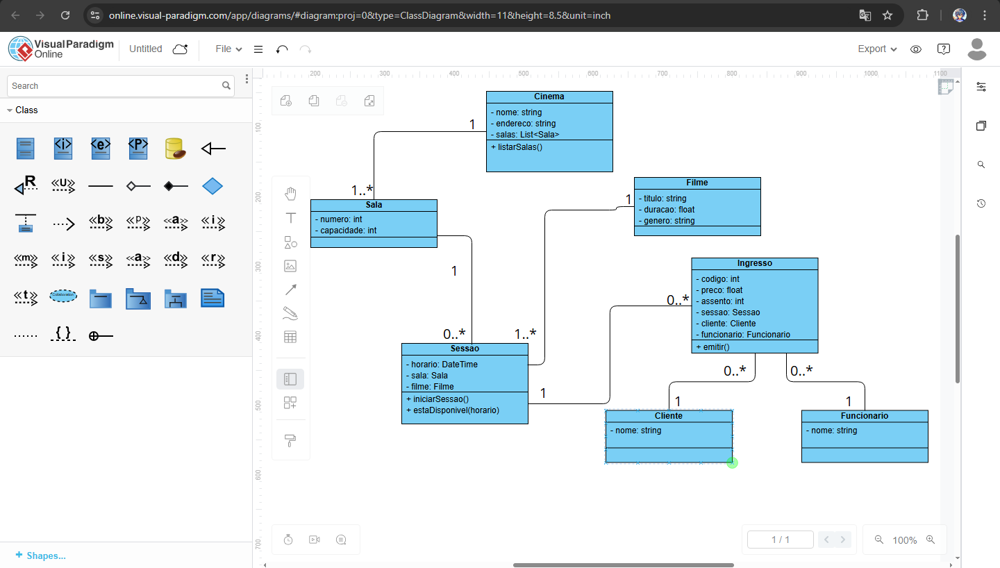
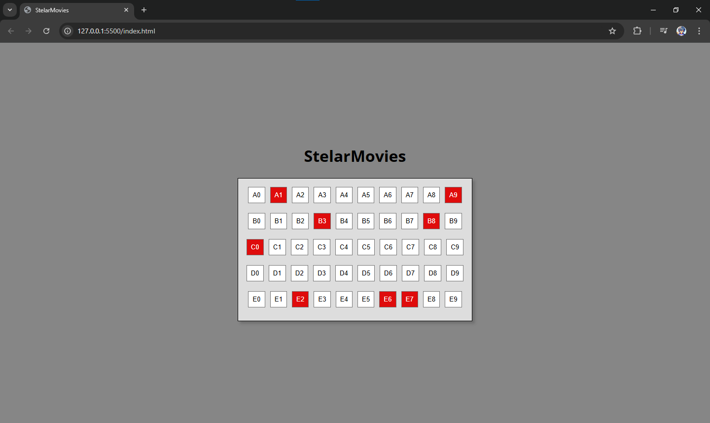

# 🎬 StelarMovies

Sistema de gerenciamento de cinema desenvolvido a partir de um **Diagrama de Classes UML**, com foco em modelagem orientada a objetos e organização arquitetural no front-end.

---

## 📚 Sobre o Projeto

O projeto **StelarMovies** nasceu após a modelagem de um sistema de cinema utilizando UML.  
A partir do diagrama, a aplicação começou a ser desenvolvida utilizando **HTML, CSS e JavaScript puro**, com foco em:

- Estruturação orientada a objetos
- Manipulação de estado
- Organização de código
- Integração entre lógica e interface

---

## 🧩 Diagrama de Classes



---

## 🚀 Funcionalidades Atuais

✔️ Criação automática de 4 salas  
✔️ Cada sala contém 50 assentos organizados em fileiras (A–E)  
✔️ Geração dinâmica dos assentos  
✔️ Reserva de assento ao clicar  
✔️ Atualização visual imediata do status  
✔️ Controle interno de estado (disponível / vendido)

---

## 🖥️ Interface Atual

A aplicação possui uma interface simples para visualização e interação com os assentos da sala.



---

## 🛠️ Tecnologias Utilizadas

- HTML5
- CSS3
- JavaScript (ES6+)

---

## 🏗️ Estrutura do Projeto

```
Cinema/
│
├──images/
├──javascript/
│  ├── models/
│  │ └── Sala.js
│  ├── main.js
│  ├── css/
│  │ └── style.css
│   index.html

```

---

## 📈 Próximas Evoluções

- Implementação da classe `Sessao`
- Integração com classe `Filme`
- Controle de múltiplas salas
- Persistência com LocalStorage
- Separação mais avançada entre UI e lógica
- Futuro consumo de API

---

## 👨‍💻 Autor

Desenvolvido por Ernand Soares 
Projeto voltado para estudo de arquitetura front-end e evolução para full-stack.
